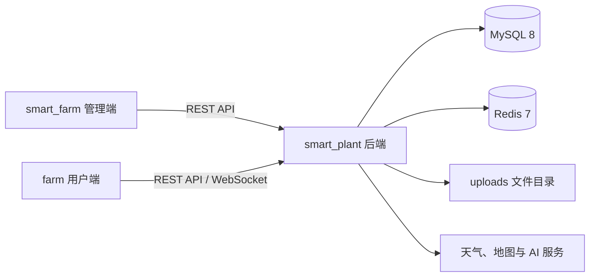

# Smart Hydroponics 智慧农业平台

Smart Hydroponics 是一个面向水培与智慧农场场景的 IoT 管理平台，仓库包含后端服务、Web 管理端和 uni-app 用户端三个工程。系统覆盖农场、地块、种植批次、作物、病虫害、设备、传感器数据、告警故障、农事任务、仓储、图片、专家咨询、即时通信和 AI 对话等业务。

## 项目组成

| 目录 | 定位 | 默认访问地址 |
| --- | --- | --- |
| `smart_plant` | Spring Boot 后端，统一为管理端和用户端提供 REST API、WebSocket、文件服务和数据访问能力 | `http://localhost:8080/smart_plant` |
| `smart_farm` | Vue 3 Web 管理端，负责平台配置和农场运营管理 | `http://localhost:5175` |
| `farm` | uni-app 用户端，面向普通用户、农场主、技术人员和专家，可运行到 App、H5 和小程序 | 由 HBuilderX 运行目标决定 |



## 主要功能

- 用户、角色、菜单权限、登录日志、操作日志和系统配置。
- 农场、地块边界、作物类型、作物、生长期和种植批次管理。
- IoT 设备、设备类型、执行计划、摄像头、环境/水质/光照/水泵数据管理。
- 告警事件、设备故障派单、维修处理、农事任务和任务时间线。
- 病虫害知识、防治措施、图片管理、仓储和系统消息。
- 专家认证、专家咨询、农场成员聊天和 WebSocket 实时消息。
- AI 模型配置、智能识别、AI 对话及 PDF/Office 附件解析。
- 用户端天气、地图、监控、拍照上传、文件下载和多角色工作台。

## 技术栈

### smart_plant 后端

- Java 21、Spring Boot 4.0.6、Maven Wrapper。
- Spring Web MVC、WebSocket、Validation、Actuator、Prometheus。
- MyBatis 4.0.1、PageHelper、Druid、MySQL 8、Flyway。
- Redis、JWT、BCrypt、基于角色和权限码的接口鉴权。
- Knife4j/OpenAPI、Apache PDFBox、Apache POI。

### smart_farm 管理端

- Vue 3.5、TypeScript 6、Vite 8。
- Element Plus、Pinia、Vue Router、Axios。
- Chart.js、高德地图 JavaScript API。

### farm 用户端

- uni-app、Vue 3、JavaScript。
- `@dcloudio/uni-ui`、ECharts、Sass。
- HBuilderX App/H5/小程序构建链路。
- App 端使用定位、地图、相机和相册能力。

## 环境要求

| 软件 | 建议版本 | 用途 |
| --- | --- | --- |
| JDK | 21 | 编译和运行 `smart_plant` |
| MySQL | 8.0+ | 主业务数据库 |
| Redis | 7.0+ | 生产环境登录状态、验证码和安全状态；本地可使用内存模式 |
| Node.js | `^20.19.0` 或 `>=22.12.0` | 运行 `smart_farm`，安装和测试 `farm` 依赖 |
| npm | 与 Node.js 配套版本 | 安装前端依赖 |
| HBuilderX | 当前稳定版 | 运行和发布 `farm` |

## 快速开始

建议按 MySQL/Redis → `smart_plant` → `smart_farm` → `farm` 的顺序启动。

### 1. 获取代码

```bash
git clone https://github.com/zjp-1997/Smart-Hydroponics.git
cd Smart-Hydroponics
```

### 2. 初始化 MySQL

先创建空数据库，表结构和基础权限数据由 Flyway 在后端首次启动时自动迁移：

```sql
CREATE DATABASE smart_plant
  CHARACTER SET utf8mb4
  COLLATE utf8mb4_0900_ai_ci;
```

迁移脚本位于 `smart_plant/src/main/resources/db/migration`。新环境应使用空数据库并保持 `FLYWAY_ENABLED=true`；`FLYWAY_BASELINE_ON_MIGRATE=true` 只用于首次接管已有历史表的数据库，不要对新库或日常启动启用。

### 3. 配置并启动 smart_plant

进入后端目录并从示例文件创建本地配置：

```powershell
cd smart_plant
Copy-Item .env.example .env
```

macOS/Linux：

```bash
cd smart_plant
cp .env.example .env
```

至少修改以下变量：

| 变量 | 说明 |
| --- | --- |
| `DB_URL` | JDBC 地址，默认数据库名为 `smart_plant` |
| `DB_USERNAME` / `DB_PASSWORD` | 本地数据库账号和密码 |
| `JWT_SECRET` | 不少于 32 字节的高熵随机字符串 |
| `FLYWAY_ENABLED` | 本地新库设置为 `true`，启动时执行迁移 |
| `REQUIRE_HTTPS` | 本地 HTTP 调试设置为 `false` |
| `SECURITY_STATE_PROVIDER` | 本地无 Redis 时使用 `memory`；生产环境使用 `redis` |
| `REDIS_HOST` / `REDIS_PORT` / `REDIS_PASSWORD` | 使用 Redis 时的连接配置 |

可选变量：

- `AMAP_WEB_SERVICE_KEY`：后端逆地理编码和天气查询使用的高德 Web 服务 Key。
- `WAQI_TOKEN`：空气质量查询 Token；未设置时使用 Open-Meteo 兜底。
- `API_DOCS_ENABLED=true`：临时开启 Knife4j/OpenAPI，接口文档仍受 JWT 鉴权保护。
- `DB_RUNTIME_*` 与 `DB_MIGRATION_*`：生产环境可分别提供 DML 运行账号和 DDL 迁移账号。

不要提交真实的 `.env`、数据库密码、JWT 密钥或第三方服务密钥。

Windows 启动命令：

```powershell
.\mvnw.cmd spring-boot:run
```

macOS/Linux：

```bash
./mvnw spring-boot:run
```

启动成功后可访问：

- API 根地址：`http://localhost:8080/smart_plant`
- 健康检查：`http://localhost:8080/smart_plant/actuator/health`
- Knife4j（启用后）：`http://localhost:8080/smart_plant/doc.html`

项目不会提供可复用的默认管理员密码。新环境的管理员账号应通过受控的初始化流程创建或重置，不要在代码、迁移脚本或 README 中保存明文凭据。

### 4. 配置并启动 smart_farm

管理端通过以下环境变量连接后端：

```dotenv
VITE_APP_TITLE=Smart Plant 管理后台
VITE_APP_API_URL=http://127.0.0.1:8080/smart_plant
VITE_AMAP_SECURITY_JS_CODE=请填写高德安全密钥
```

开发环境修改 `smart_farm/.env.development`，生产构建修改 `smart_farm/.env.production`。高德 Key 和安全密钥应按部署域名配置并通过安全方式注入。

```bash
cd smart_farm
npm ci
npm run dev
```

开发服务器固定监听 `0.0.0.0:5175`，浏览器访问 `http://localhost:5175`。

常用命令：

```bash
npm run type-check  # TypeScript/Vue 类型检查
npm test            # 管理端测试
npm run build       # 类型检查并生成 dist
npm run preview     # 在 0.0.0.0:4174 预览生产构建
```

### 5. 配置并运行 farm

`farm` 当前以 HBuilderX 为主要运行入口，`package.json` 只声明页面需要的 npm 依赖，没有配置独立的 `npm run dev` 命令。

1. 使用 HBuilderX 打开 `farm` 目录。
2. 在 HBuilderX 终端执行 `npm install`，或使用 HBuilderX 的 npm 依赖安装功能。
3. 确认项目使用 Vue 3，`manifest.json` 中的 App/小程序标识、地图 SDK 和平台权限已按自己的应用完成配置。
4. 选择“运行到浏览器”“运行到手机或模拟器”或目标小程序开发者工具。

H5 调试会自动使用当前页面主机并请求其 `8080` 端口。App 真机无法使用电脑的 `127.0.0.1`，需要让手机和开发机位于同一局域网，并在 `farm/utils/request.js` 中把 `APP_DEFAULT_BASE_URL` 改为开发机局域网地址，例如：

```js
const APP_DEFAULT_BASE_URL = 'http://192.168.1.100:8080'
```

也可以在运行时通过本地存储项 `farm_api_base_url` 覆盖默认地址。真机联调还需确认：

- 手机能够访问 `http://开发机IP:8080/smart_plant/actuator/health`。
- 操作系统防火墙允许后端 `8080` 端口和管理端 `5175` 端口。
- 小程序已配置合法 request/uploadFile/downloadFile/socket 域名；开发阶段可在开发者工具中临时关闭域名校验。
- 生产环境使用 HTTPS，并将后端 CORS 白名单调整为实际域名。

## 测试与构建

### 后端

```powershell
cd smart_plant
.\mvnw.cmd test
.\mvnw.cmd clean package
```

构建产物位于 `smart_plant/target`。部署时应从外部注入环境变量，并为运行目录下的 `uploads` 配置持久化存储。

### 管理端

```bash
cd smart_farm
npm ci
npm test
npm run build
```

构建产物位于 `smart_farm/dist`，可部署到 Nginx 等静态 Web 服务器；SPA 部署需要将未知路由回退到 `index.html`。

### 用户端

`farm/tests` 中的测试是可直接由 Node.js 执行的脚本。PowerShell 下可运行：

```powershell
cd farm
Get-ChildItem tests -File | ForEach-Object { node $_.FullName }
```

App、小程序和 H5 的正式构建与签名发布通过 HBuilderX 完成。

## 关键配置位置

| 配置 | 文件 |
| --- | --- |
| 后端端口、上下文路径、数据源、Redis、Flyway、鉴权 | `smart_plant/src/main/resources/application.yml` |
| 后端本地环境变量示例 | `smart_plant/.env.example` |
| 数据库版本迁移 | `smart_plant/src/main/resources/db/migration` |
| 管理端 API 地址和高德安全配置 | `smart_farm/.env.development`、`smart_farm/.env.production` |
| 管理端端口和构建配置 | `smart_farm/vite.config.ts` |
| 用户端 API 地址 | `farm/utils/request.js` |
| 用户端应用、权限和平台配置 | `farm/manifest.json` |
| 用户端页面和导航配置 | `farm/pages.json` |

## 生产部署注意事项

- 生产环境必须使用高熵 `JWT_SECRET`、HTTPS 和 Redis 安全状态存储。
- 数据库迁移建议由单实例作业执行，并使用独立的迁移账号；应用运行账号只授予必要的 DML 权限。
- 不要在 Git 仓库中保存 `.env`、数据库凭据、Redis 密码、地图 Key、AI API Key 或签名证书。
- `smart_plant/uploads` 包含业务上传文件，容器化或多实例部署时必须挂载持久化共享存储。
- 当前后端 CORS 面向本地和私有局域网开发地址；公网部署前应在 `WebMvcConfig` 中收敛为真实 HTTPS 域名。
- 管理端的 `VITE_*` 变量在构建时写入前端产物，只能保存可公开的客户端配置，不能放置服务端密钥。
- AI 模型的 Base URL、API Key 和模型名由管理端模型管理功能配置，不要硬编码到前端。

## License

本项目使用 [MIT License](LICENSE)。
